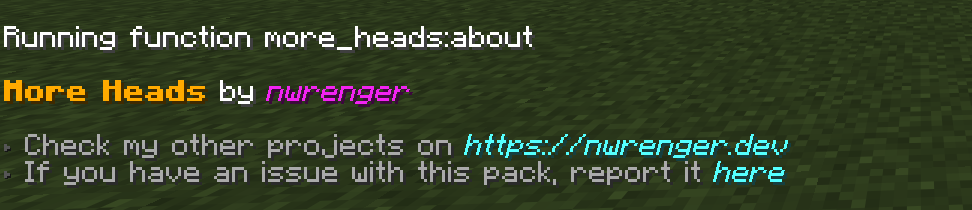
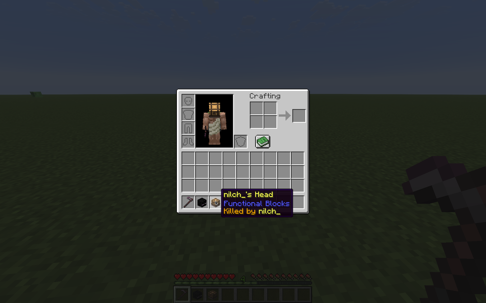

# More Heads

[](https://modrinth.com/datapack/more-heads)
[](https://modrinth.com/datapack/more-heads)
[](https://modrinth.com/datapack/more-heads)

Adds **easier** access to **more heads**, including **mob heads** and **player heads**, **without** polluting farms or breaking vanilla progression.

> Expands head collecting while keeping drops survival-friendly and tied to vanilla-style progression.

## Installation

After adding the data pack/mod to your world or server, you can open the about panel with:

```mcfunction
/function more_heads:about
```



## Usage

This pack makes head collection more accessible without breaking progression or interfering with existing farms and grinders.

### Mob Heads

Mobs drop their heads when killed with a hoe. This keeps head collecting intentional and prevents passive farms or grinders from producing extra heads.


### Player Heads

Players drop their heads when killed by another player. The one who killed them will be shown on the tooltip of the head.



## Contributing & Issues

I warmly welcome:

- Bug reports
- Feature requests
- Pull requests

Please open issues or PRs on [GitHub](https://github.com/nwrenger/more-heads/issues).

## License

This project is licensed under the **LGPLv3 License**. See [LICENSE](https://github.com/nwrenger/more-heads/blob/main/LICENSE) for details.
