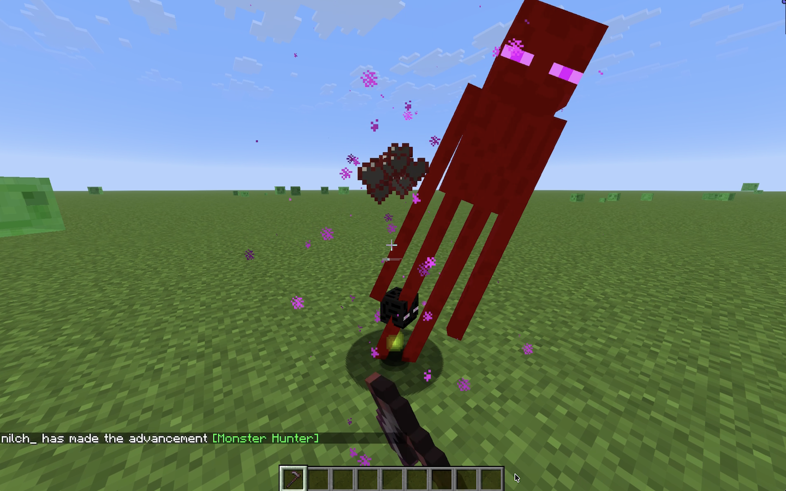

# More Heads

[](https://modrinth.com/datapack/more-heads)
[](https://modrinth.com/datapack/more-heads)
[](https://modrinth.com/datapack/more-heads)

Adds **survival-friendly** access to **mob heads** and **player heads**, using **intentional hoe-based drops** to avoid farm pollution and preserve vanilla progression.

> Expands head collecting by making mob and player heads a deliberate survival reward, not an automatic byproduct.

## Why use this data pack/mod?

1. **Preserves farms and grinders**:
   Hoe-based drops keep farms and grinders from filling up with unwanted head drops.
2. **Vanilla-style items**:
   Heads use fitting note block sounds, clean names, and subtle tooltip styling so they feel like part of the game.
3. **Lightweight and passive**:
   Built around loot tables and pack overlays, without ticking functions, command-heavy systems, or extra runtime overhead.
4. **Flexible installation**:
   Works as either a world-specific data pack or packaged mod, making it easy to use in singleplayer, servers, vanilla, and modded setups.

## Installation

After adding the data pack/mod to your world or server, you can open the about panel with:

```mcfunction
/function more_heads:about
```


## Mob Heads

Mobs drop their heads when killed with a **hoe**. This keeps head collecting **intentional** and prevents passive farms or grinders from producing extra heads. The **Wither Skeleton** and **Ender Dragon** are excluded, keeping their **vanilla progression intact**.

> **Enderman Head Drop**
>
> 

## Player Heads

Players drop their heads when killed **by another player**. The killer **is shown** on the head's tooltip.

> **Player Head Tooltip**
>
> 

## Contributing & Issues

I warmly welcome:

- Bug reports
- Feature requests
- Pull requests

Please open issues or PRs on [GitHub](https://github.com/nwrenger/more-heads/issues).

## License

This project is licensed under the **LGPLv3 License**. See [LICENSE](https://github.com/nwrenger/more-heads/blob/main/LICENSE) for details.
